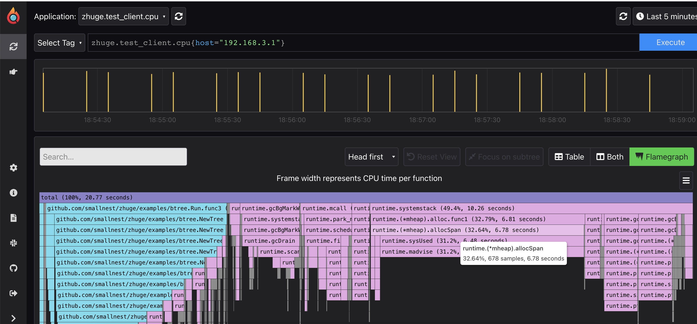

# 诸葛
救命用的profile。

在程序CPU、内存等异常的情况下，自动生成Profile并提交到Profiler以便分析。




## 安装

### 首先，你需要部署一个 pyroscope server

安装方式很简单，官方提供各种操作系统的安装命令，并且你还可以通过Docker安装，或者部署在Kubernates环境中。

建议你配置身份认证功能，这样就避免别人恶意往你的服务器中灌数据。并且设置数据保留的期限，节省成功。

我通过rpm安装在Linux操作系统中,所以修改配置`/etc/pyroscope/server.yml` 如下：

```yaml
retention: 24h

auth:
  # Specifies which role will be granted to a newly signed up user.
  # Supported roles: Admin, ReadOnly. Defaults to ReadOnly.
  # The parameter affects all authentication providers.
  signup-default-role: ReadOnly
  # Internal authentication provider configuration.
  internal:
    enabled: true
    signup-enabled: false
```

### 在你的应用中发送Profile

官方的pyroscope agent会定时每10秒发送profile到pyroscope server。

正如官方所说，采集profile会带来2%~5%性能的损耗，不止于此，每10秒的采样数据也会带来磁盘的占用，所以我们想在必要、紧急的情况下才上传profile。

这正是这个项目的目的。

你可以通过下面的`initPyroscope`方法，在你的应用程序中配置Pyroscope,注意修改你的Pyroscope server地址和token。

```go
package main

import (
	"math/rand"
	"os"
	"time"

	"github.com/smallnest/zhuge"
	"github.com/smallnest/zhuge/examples/btree"
)

func init() {
	rand.Seed(time.Now().UnixNano())
}

var profiler *zhuge.SampleProfiler

func main() {
	initPyroscope()

	tick := time.NewTicker(10 * time.Second)

	for range tick.C {
		btree.Run(16)
	}
}

func initPyroscope() {
	sc := zhuge.Config{
		ApplicationName: "zhuge.test_client",
		ServerAddress:   "http://rpcx.io:4040",
		Tags:            map[string]string{"host": "192.168.3.1"},

		Logger: zhuge.StandardLogger,

		AuthToken: os.Getenv("PYROSCOPE_AUTH_TOKEN"),

		ProfileTypes: []zhuge.ProfileType{
			zhuge.ProfileCPU,
			zhuge.ProfileAllocObjects,
			zhuge.ProfileAllocSpace,
			zhuge.ProfileInuseObjects,
			zhuge.ProfileInuseSpace,
		},
	}
    var err error
	profiler, err = zhuge.NewSampleProfiler(sc)
	if err != nil {
		panic(err)
	}
}
```


然后你可以在想采样的时候执行下面的语句就可以自动采样一次了:

```go
go profiler.SampleNow()
```

## TODO

下一步计划是参考[mosn/holmes](https://github.com/mosn/holmes)处理逻辑，由用户设定采样的触发条件，比如CPU占用高或者内存占用高的时候自动采样上传。

欢迎一起开发它的功能。


## Credits 

- [pyroscope-io/client](https://github.com/pyroscope-io/client): the initial codes is cloned from pyroscope-io/client.